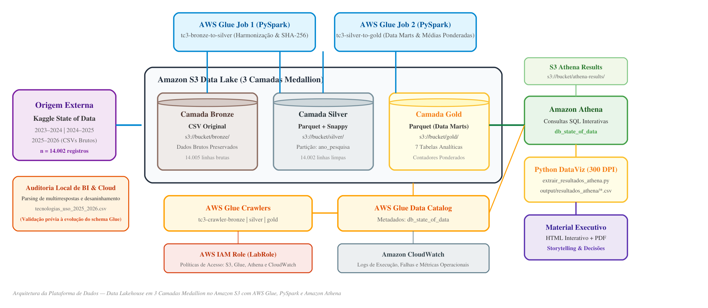
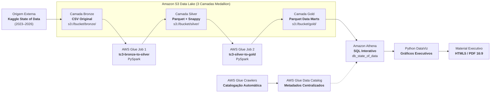

# State of Data Brazil — Data Lake & Analytics Platform

## Contexto do Projeto

Plataforma analítica e estratégica de Big Data desenvolvida para orientar a tomada de decisão executiva de uma **Instituição Financeira de grande porte** no planejamento de expansão das áreas de Dados, Analytics e Inteligência Artificial no mercado brasileiro.

Para fundamentar as diretrizes de atração, remuneração, capacitação de equipes, políticas de trabalho e investimentos tecnológicos, foi implementado um pipeline analítico em nuvem (**AWS**), processando os microdados históricos das edições da pesquisa **State of Data Brasil** (2023–2024, 2024–2025 e 2025–2026), conduzida pela comunidade Data Hackers em parceria com a Bain & Company.

A solução abrange desde a ingestão dos dados na camada **Bronze** em Data Lake até o processamento distribuído com **PySpark**, estruturação nas camadas **Silver** e **Gold** (Arquitetura Medallion), catalogação no **AWS Glue Data Catalog**, consultas analíticas no **Amazon Athena** e consolidação de resultados em material executivo interativo e documental.

---

## Arquitetura da Solução AWS (3 Camadas Medallion)

A arquitetura adota o padrão de **Data Lakehouse em 3 Camadas** no Amazon S3 com governança centralizada no AWS Glue:

<p align="center">
  
</p>

> Diagrama técnico disponível em formato editável [`diagrams/arquitetura_aws.drawio`](diagrams/arquitetura_aws.drawio) e vetorizado [`diagrams/arquitetura_aws.svg`](diagrams/arquitetura_aws.svg).

<details>
<summary><b>Visualizar especificação técnica em Mermaid</b></summary>



</details>

### Detalhamento das Camadas de Dados

* **Camada Bronze (`s3://<bucket>/bronze/`)**: Armazenamento e catalogação dos dados brutos originais das pesquisas (2023–2024, 2024–2025 e 2025–2026), mantendo a fidelidade integral das respostas primárias.
* **Camada Silver (`s3://<bucket>/silver/`)**: Dados normalizados, tipados e enriquecidos. Abrange a harmonização de esquemas heterogêneos entre as edições, conversão de tipos de dados, padronização de taxonomias (cargos, modelos de trabalho e níveis de senioridade), cálculo contínuo de estimativa salarial e eliminação de redundâncias via hash SHA-256 para respostas sem identificador de token. Armazenamento colunar em formato **Parquet** particionado por `ano_pesquisa`.
* **Camada Gold (`s3://<bucket>/gold/`)**: Data Marts agregados e otimizados para consumo analítico no Amazon Athena e geração de relatórios executivos. Contempla o desaninhamento (*explode*) de tecnologias multivaloradas e cálculo de bases com pesos amostrais.

---

## Eixos Analíticos Estratégicos

O pipeline analítico foi estruturado para responder a sete eixos fundamentais para o planejamento da instituição financeira:

1. **Estrutura do Mercado**: Distribuição demográfica, concentração geográfica e perfis de maturidade profissional no Brasil.
2. **Valorização Profissional**: Níveis salariais médios ponderados por cargo, senioridade e especialidade técnica.
3. **Diversidade e Representatividade**: Evolução da representatividade de gênero e disparidades brutas observadas na amostra.
4. **Adoção Tecnológica**: Penetração efetiva de plataformas cloud (AWS, Azure, GCP), ferramentas de BI e linguagens de programação.
5. **Inteligência Artificial & GenAI**: Nível de priorização estratégica corporativa e adoção de ferramentas de produtividade por profissionais.
6. **Modelos de Trabalho & Satisfação**: Distribuição entre regimes presenciais, híbridos e remotos, correlacionados aos índices de satisfação declarada.
7. **Diretrizes Executivas**: Matriz de decisões com plano de ação de 90 dias focado em eficiência de capital e governança.

---

## Estrutura do Repositório

```text
state-of-data-brazil/
│
├── config/
│   ├── aws_credentials.template.json # Modelo para configuração de credenciais AWS
│   └── mapeamento_colunas.json       # Mapeamento declarativo de esquemas e normalizações
│
├── data/
│   ├── bronze/                       # Dados brutos das edições da pesquisa (ignorado no Git)
│   │   └── .gitkeep
│   └── processed/                    # Dados processados nas camadas Silver e Gold (ignorado no Git)
│       └── .gitkeep
│
├── diagrams/
│   ├── arquitetura_aws.drawio        # Diagrama técnico editável da arquitetura AWS (Draw.io)
│   ├── arquitetura_aws.png           # Imagem da arquitetura em alta definição (2292x1000)
│   └── arquitetura_aws.svg           # Vetor escalável da arquitetura da plataforma
│
├── docs/
│   ├── dicionario_dados.md           # Catálogo e semântica de todas as variáveis
│   ├── mapeamento_edicoes.md         # Matriz de correspondência de colunas entre as 3 edições
│   ├── regras_transformacao.md       # Regras de tratamento, deduplicação e fórmulas de cálculo
│   └── relatorio_qualidade.md        # Relatório de auditoria e Quality Gate das camadas
│
├── notebooks/
│   ├── 01_analise_exploratoria.ipynb # Inspeção inicial dos metadados da Camada Bronze
│   ├── 02_validacao_silver.ipynb     # Auditoria de integridade e validação da Camada Silver
│   └── 03_analises_negocio.ipynb     # Consultas e análises estratégicas da Camada Gold
│
├── output/
│   ├── apresentacao/                 # Material executivo final e documentação de entrega
│   │   ├── apresentacao_state_of_data.html # Apresentação interativa em 16:9 widescreen
│   │   ├── apresentacao_state_of_data.pdf  # Relatório executivo oficial em PDF 16:9 widescreen
│   │   ├── LEIA-ME.md               # Guia de navegação e visualização executiva
│   │   └── assets/                  # Gráficos executivos em alta definição (PNG)
│   ├── graficos/                     # Visualizações exploratórias da Camada Bronze
│   ├── resultados_athena/            # Extrações tabulares consolidadas via SQL no Athena
│   └── analises_complementares/      # Análises de conciliação de ferramentas (BI/Cloud)
│
├── scripts/
│   ├── aws/
│   │   ├── setup_infrastructure.sh   # Automação de provisionamento S3 e Glue Data Catalog
│   │   └── upload_to_s3.py           # Ingestão de arquivos brutos para a camada Bronze do S3
│   ├── etl/
│   │   ├── glue_job_bronze_to_silver.py # AWS Glue Job PySpark: Ingestão, limpeza e normalização
│   │   ├── glue_job_silver_to_gold.py   # AWS Glue Job PySpark: Data Marts e agregações
│   │   └── pipeline_silver_gold.py   # Pipeline local reprodutível para testes e validações
│   ├── analytics/
│   │   ├── extrair_resultados_athena.py # Automação de execução e download de queries do Athena
│   │   ├── gerar_graficos_executivos.py # Geração das visualizações executivas a partir dos dados
│   │   └── queries_athena.sql        # Consultas SQL analíticas com médias ponderadas
│   └── quality/
│       ├── validacao_qualidade.py    # Suíte de testes de asserção (Quality Gate)
│       └── executar_notebooks.py     # Execução automatizada e validação dos notebooks
│
├── .env.example                      # Modelo de variáveis de ambiente para AWS
├── .gitignore                        # Regras de exclusão do Git
├── requirements.txt                  # Dependências e bibliotecas Python
└── README.md                         # Documentação técnica e arquitetural da plataforma
```

---

## Guia de Execução

### 1. Pré-requisitos
* Python 3.10 ou superior.
* Acesso a ambiente AWS (S3, AWS Glue e Amazon Athena).
* AWS CLI configurado localmente (`aws configure`) ou credenciais via variáveis de ambiente.

### 2. Instalação de Dependências Locais
```bash
pip install -r requirements.txt
```

### 3. Provisionamento da Infraestrutura AWS
Execução do script de automação para criação da estrutura de buckets no S3 e registro do database no AWS Glue Data Catalog:
```bash
chmod +x scripts/aws/setup_infrastructure.sh
./scripts/aws/setup_infrastructure.sh
```

### 4. Ingestão dos Dados na Camada Bronze
Transferência dos arquivos brutos para o prefixo Bronze no Amazon S3:
```bash
python scripts/aws/upload_to_s3.py --bucket <nome-do-bucket> --data-dir ./data/bronze
```

### 5. Processamento Distribuído no AWS Glue
No console do AWS Glue ou via AWS CLI:
1. Executar o job [`glue_job_bronze_to_silver.py`](scripts/etl/glue_job_bronze_to_silver.py) com os parâmetros `--BUCKET_NAME` e `--DATABASE_NAME`.
2. Executar o job [`glue_job_silver_to_gold.py`](scripts/etl/glue_job_silver_to_gold.py) para consolidação dos Data Marts.

### 6. Consultas Analíticas no Amazon Athena
No editor de consultas do Amazon Athena, utilizar o database `db_state_of_data` e executar as consultas documentadas em [`scripts/analytics/queries_athena.sql`](scripts/analytics/queries_athena.sql) para extração dos indicadores consolidados.

---

## Entrega do Tech Challenge

Acesso direto aos principais artefatos e entregáveis do projeto:

* [Apresentação executiva em PDF](output/apresentacao/apresentacao_state_of_data.pdf)
* [Apresentação interativa em HTML](output/apresentacao/apresentacao_state_of_data.html)
* [Diagrama editável da arquitetura AWS](diagrams/arquitetura_aws.drawio)
* [Consultas analíticas no Athena](scripts/analytics/queries_athena.sql)
* [Job PySpark Bronze → Silver](scripts/etl/glue_job_bronze_to_silver.py)
* [Job PySpark Silver → Gold](scripts/etl/glue_job_silver_to_gold.py)
* [Notebooks do projeto](notebooks/)

### Detalhamento dos Entregáveis

1. **Apresentação Executiva Interativa e Documental**:
   * [`output/apresentacao/apresentacao_state_of_data.html`](output/apresentacao/apresentacao_state_of_data.html): Relatório interativo em formato widescreen (16:9) com navegação por teclado e índice lateral.
   * [`output/apresentacao/apresentacao_state_of_data.pdf`](output/apresentacao/apresentacao_state_of_data.pdf): Documento formal em 18 páginas widescreen para distribuição institucional.
2. **Arquitetura da Plataforma AWS**:
   * [`diagrams/arquitetura_aws.drawio`](diagrams/arquitetura_aws.drawio): Diagrama técnico editável no Draw.io detalhando todo o fluxo de ingestão, processamento e catálogo nas 3 camadas.
   * [`diagrams/arquitetura_aws.png`](diagrams/arquitetura_aws.png): Visualização estática em alta resolução (2292x1000) incorporada diretamente à documentação.
3. **Engenharia e Governança de Dados**:
   * Scripts de infraestrutura como código (IaC), jobs PySpark para processamento distribuído, suíte de qualidade de dados com 16 asserções de Quality Gate e catálogo completo de variáveis.
